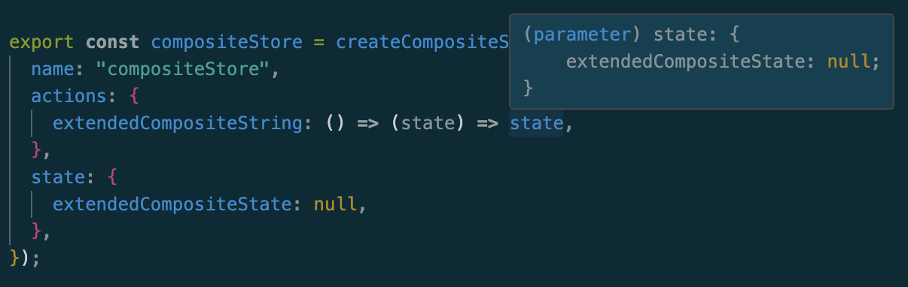

# Enable Type Inference
This section of documentation will explain the type inference mechanism using examples. For the purposes of this document, we will use the following two store definitions:

```javascript
export const counterStore = createStore({
  name: "counterStore",
  actions: {
    increase: () => (state) => state.counter++,
  },
  state: {
    counter: 0,
  },
});
```
```javascript
export const infoStore = createStore({
  name: "infoStore",
  actions: {
    setInfo: (s: string) => (state) => (state.info = s),
  },
  state: {
    info: "default",
  },
});
```

Nothing special here. This is a normal store creation using the `createStore` function, which so far does not differ from a pure JavaScript implementation.

To activate type support, *which we highly recommend*, you must extend the global interface RlxStores with the types of the created stores. This is because we use the RlxStores interface in the library to assign the types of individual stores to their respective stores. The `typeof` operator can be used to easily infer the types of the stores, so you don't have to manually type them.

```typescript
declare global {
  interface RlxStores {
    counterStore: typeof counterStore;
    infoStore: typeof infoStore;
  }
}
```

The keys can be named as you wish, with the exception that they must be unique, but TypeScript will yell at you anyway if the same keys are assigned multiple times.
The naming of the keys is used to assign actions to specific stores. This means that it is assumed that across different stores, actions exist that have the same name. To correctly identify the correct action for rules added to a store, the following syntax must be used as the target: `storeName/actionName`. The type system extracts the keys from the global interface and assigns the associated actions to this store, resulting in type support when selecting the targets.

That's all for now. Let's look at what you get in return from the TypeScript compiler as support.

**Type Inference in Store Creation**
Already in store creation, when you create actions and want to use the state in them, you get the correctly typed state of the store (because an action within a store can only access the states of that store)


**Type Inference in the Targets of Rules**
Rules can have an action as a target, which they react to. These targets can be actions of the same store or actions of another store. Since the names of actions across different stores are not unique, the target is pre-tagged with the store name (see also naming of keys in the global store). The compiler suggests possible targets.


**Type Inference in the Consequence of Rules**
A rule can have a consequence. This consequence receives `args` as a parameter. These `args` have properties `getState()` and `action`.

**State**
`getState()` returns the state for the store to which the rule is added. This means for the rule added to the `counterStore`, we have access to the type:


and for the `infoStore`...


**Action**
An action has as return values the `type`, `payload`, and `meta`. The action has the peculiarity that it depends on the chosen targets. This means, in the following example, you have access to the type of both actions that were chosen as targets.


You get a discriminated union of all actions you have access to in this consequence. If you perform a runtime check (type narrowing) of which `type`/`meta`/`payload` the underlying action is, TypeScript correctly infers the type.


### Hint
**Typing the Actions Args**

During the creation of the actions in the store creation, we manually typed our parameter `s` in the setInfo action.

```javascript
...
  actions: {
    setInfo: (s: string) => (state) => (state.info = s),
  },
...
```
This step is manually necessary because Rlx-Store cannot know what type this parameter is. We strongly recommend typing it for two reasons. Firstly, you have type safety within the action. More importantly, this type is then also used, for example, in rules, to correctly infer the type of the arguments.
As you can see in the following example, the parameter `s` is correctly recognized as a `string`. If we had not typed it, `s` would be of type `any` at this point.


### Creating a Composite Store
A composite store is created using a higher-order function that returns a `createStore` function. This method is useful when you need a templated store that can be configured with additional actions and state properties.

This approach requires a bit more configuration to fully benefit from the type system. This is because we cannot know what type the config is in the case of the following example:

```javascript
import { ActionsType, StoreConfig } from "rlx-store";

const createCompositeStore = <
  Name extends string,
  State extends Record<string, unknown>,
  Actions extends ActionsType<State>
>(
  config: StoreConfig<Name, State, Actions>
) => {
  return createStore({
    name: "compositeStore",
    actions: {
      compositeNumber: (n: number) => (state) => state.compositeNumber++,
      ...config.actions,
    },
    state: {
      compositeNumber: 0,
      ...config.state,
    },
  });
};

export const compositeStore = createCompositeStore({
  name: "compositeStore",
  actions: {
    extendedCompositeString: (s: string) => (state) => 
      ({state.extendedCompositeState = s}),
  },
  state: {
    extendedCompositeState: null,
  },
});
```

Therefore, we must first import the two types from the package. The type parameters `<Name, State, Actions>` are crucial for the function to correctly infer the types. These parameters can be named differently, but it's important that, on the one hand, the last parameter, which describes the `actions`, is wrapped with the `ActionsType`, and the `state`, the second type, is given as a type. The config in the chosen example must be of the `StoreConfig` type, and the three `args` must be given.


**Limitations for Composite-Stores**

Within the creation of the actions in the `createStore` configuration, the state can only be correctly inferred from the current store. Since logically it is not yet clear at that point what configuration the store will be extended with, these values cannot be inferred either.


The same applies to the use of `createCompositeStore` in the case when it is used to create a new store, the state is also only of the type of the currently created/extending store.

